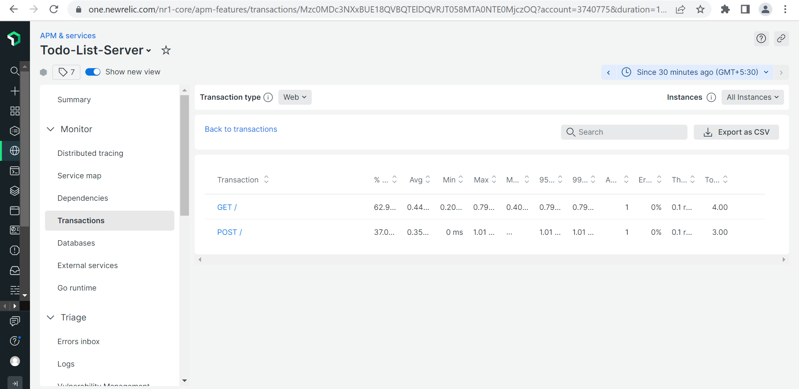

# NewRelic Integration with swagger generated rest api application
 - This repo has pre swagger generated go files, which uses swagger.yaml as spec.
 ## Target
 - We need to enable New Relic APM capabilities for our microservices built using Go Swagger (https://github.com/go-swagger/go-swagger)
 ## Problems faced
 1. Web Transactions are being displayed on the dashboard but the Name of the Web transactions are not being inferred correctly from URL nor are we able to customize it. Since the low level code is auto generated during scaffolding of app, we tried wrapping the handler function inside the middleware but to no avail.
 2. In our local application setup, we can atleast see some data on the NR Dashboard but in a protected, restricted environment, though the application runs and connects to NR but no data can be seen on the New Relic Dashboard.
 
 ## Pre-Requisites
 - Install latest golang (Pls follow the doc https://go.dev/doc/install)
## How to Compile and run
- Once the code has been cloned, pls run `go mod tidy` form the NR-POC directory.
- This repo has pre-generated go files, no need to generate them again
- Go to cmd\a-to-do-list-application-server 
  `cd cmd\a-to-do-list-application-server`
- run `go build -o nrpoc.exe main.go`, this will genreate a binary nrpoc.exe for windows env
- For Linux/MAC env, just build it with `go build -o nrpoc main.go`, this will geneate binary nrpoc that could run on Linxu or MAC OS
- Run the binary with the command  `.\nrpoc --port 3000`, this will serve application on port 3000
## Integration of NewRelic Agent with swagger generated codebase
- The swagger generated code has a part which is editable, that the swagger tool wont regenerate or overwrite the code again.
- Open this file restapi\configure_a_to_do_list_application.go which has an go init function, that initializes the new relic go-agent with app name, license key etc
```
func init() {
	fmt.Println("Initializing new relic configs")
	NewRelicAppClient, err = newrelic.NewApplication(
		newrelic.ConfigAppName("Todo-List-Server"),
		newrelic.ConfigLicense(""),
		newrelic.ConfigAppLogForwardingEnabled(true),
		newrelic.ConfigAppLogEnabled(true),
		newrelic.ConfigCodeLevelMetricsEnabled(true),
	)
}`
```
- The middleware function is where we are trying to get the rest endpoints dynamically 
```
func setupMiddlewares(handler http.Handler) http.Handler {
	return handler
}
```

#### What we tried in the middlewares section
 - We tried wrapping the handler as seen in most examples.
     ```
     func setupGlobalMiddleware(handler http.Handler) http.Handler {
    	_, h := newrelic.WrapHandleFunc(AppNR, "/", handler.ServeHTTP)
    	return http.HandlerFunc(h)
    }
     ```
  - We can now hit the local server running like
  1. GET http://localhost:3000/
  2. POST http://localhost:3000/
      payload: 
        ```
        {
        "description": "Test1",
        "completed": false
        }
      ```
  - Using this approach we are able to see the Web Transactions on the dashboard but as mentioned before all the Web Requests get the same static name "**/**" as mentioned in the middleware.
  - For Example, we see transactions like "GET /", "POST /". What we need is names either defined by us or inferred from the URL.



  
  


